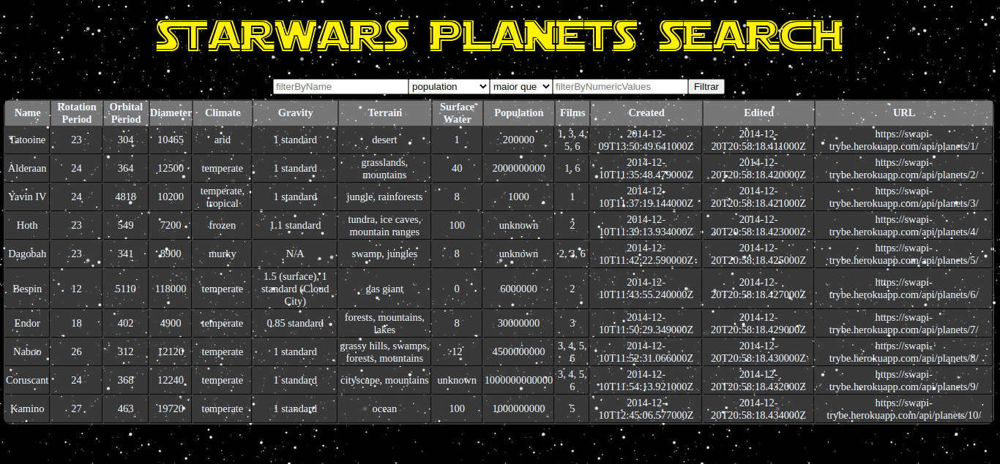

# Boas vindas ao repositório do projeto Starwars Planets Search! 

### O que foi desenvolvido

Desenvolvi uma lista de planetas, com filtros, do universo de Star Wars.

Utilizei **Context API e Hooks** para controlar os estados globais e a [API de StarWars](https://swapi-trybe.herokuapp.com/api/planets/) para fazer as requisições.

---

### Habilidades

Nesse projeto utilizei:

* A _Context API_ do **React** para gerenciar estado.
* O _React Hook useState_;
* O _React Hook useContext_;
* O _React Hook useEffect_;
* Criei _React Hooks_ customizados.

---

### Instruções para instalação/utilização do projeto localmente:

1. Abra o terminal e crie um diretório no local de sua preferência com o comando mkdir:
    * `mkdir projetos-analuisa`
2. Entre no diretório que acabou de criar e depois clone o projeto:
    * `cd projetos-analuisa`
    * `git clone git@github.com:analuisams99/project-starwars-planets-search.git`
3. Acesse o diretório do projeto e depois utilize o comando npm install para instalar todas as dependências necessárias:
    * `cd project-starwars-planets-search`
    * `npm install`
4. Inicialize o projeto:
    * `npm start` (uma nova página deve abrir no seu navegador)
    * (Caso uma nova não abra, acesse o projeto via browser, no caminho http://localhost:3000 )

---

   <h4 align="left">Um gostinho de como ficou: </h4>
   

---

May the force 💪 be with you.

Projeto realizado por Ana Luisa Marques Simões.
